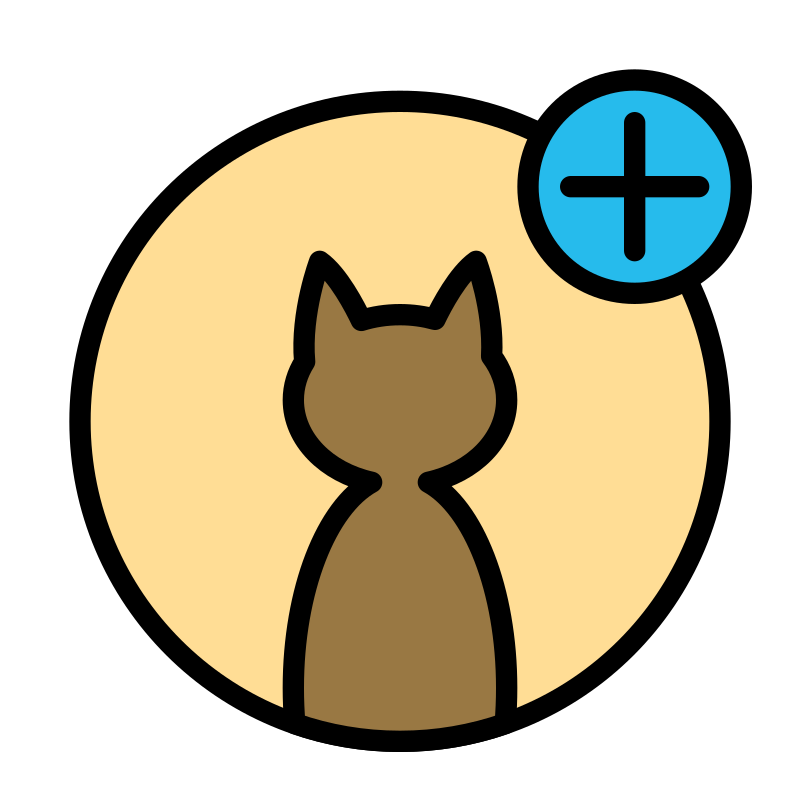

<a name="readme-top"></a>

[![Contributors][contributors-shield]][contributors-url]
[![Forks][forks-shield]][forks-url]
[![Stargazers][stars-shield]][stars-url]
[![Issues][issues-shield]][issues-url]
[![MIT License][license-shield]][license-url]
[![LinkedIn][linkedin-shield]][linkedin-url]

<!-- PROJECT LOGO -->
<br />
<div align="center">
  <a href="https://github.com/MateuszKrolik/React_TypeScript_RxJs_MUI_Cat_Facts_Web_App_FrontEnd">
    
  </a>

<h3 align="center">React_TypeScript_RxJs_MUI_Cat_Facts_Web_App_FrontEnd</h3>
  <p align="center">
    <br />
    <a href="https://github.com/MateuszKrolik/React_TypeScript_RxJs_MUI_Cat_Facts_Web_App_FrontEnd"><strong>Explore the docs »</strong></a>
    <br />
    <br />
    <a href="https://github.com/MateuszKrolik/React_TypeScript_RxJs_MUI_Cat_Facts_Web_App_FrontEnd">View Demo</a>
    ·
    <a href="https://github.com/MateuszKrolik/React_TypeScript_RxJs_MUI_Cat_Facts_Web_App_FrontEnd/issues">Report Bug</a>
    ·
    <a href="https://github.com/MateuszKrolik/React_TypeScript_RxJs_MUI_Cat_Facts_Web_App_FrontEnd/issues">Request Feature</a>
  </p>
</div>

<!-- TABLE OF CONTENTS -->
<details>
  <summary>Table of Contents</summary>
  <ol>
    <li>
      <a href="#about-the-project">About The Project</a>
      <ul>
        <li><a href="#built-with">Built With</a></li>
      </ul>
    </li>
    <li>
      <ul>
        <li><a href="#prerequisites">Prerequisites</a></li>
        <li><a href="#installation">Installation</a></li>
      </ul>
    </li>
    <li><a href="#roadmap">Roadmap</a></li>
    <li><a href="#contributing">Contributing</a></li>
    <li><a href="#license">License</a></li>
    <li><a href="#contact">Contact</a></li>
    <li><a href="#acknowledgments">Acknowledgments</a></li>
  </ol>
</details>

<!-- ABOUT THE PROJECT -->

### Look at below video to see the SPA FrontEnd in action 😉:

https://github.com/user-attachments/assets/6032f700-a039-430d-b190-6dda17b5b26e

### Or simply check out this link 😁:

[Project Link](https://gray-smoke-0178eac03.5.azurestaticapps.net/)

### Built With

<!-- Programming Languages -->

- [![TypeScript][TypeScript.com]][TypeScript-url]
- [![JavaScript][JavaScript.com]][JavaScript-url]

<!-- Web Technologies -->

- [![React][React]][React-url]
- [![Vite][Vite]][Vite-url]
- [![RxJS][RxJS.com]][RxJS-url]
- [![Material Design][Material-Design.com]][Material-Design-url]
- [![MUI][MUI]][MUI-url]
- [![HTML5][HTML5.com]][HTML5-url]
- [![CSS3][CSS3.com]][CSS3-url]
<!-- add materialUI -->

<!-- Devtools -->

- [![Linux][Linux.com]][Linux-url]
- [![Docker][Docker.com]][Docker-url]

<!-- Cloud Deployment Services -->

- [![Azure][Azure.com]][Azure-url]
- [![Azure Static Web Apps][Azure-Static-Web-Apps.com]][Azure-Static-Web-Apps-url]
- [![GitHub Actions][GitHub-Actions.com]][GitHub-Actions-url]

<!-- Data Formats -->

- [![YAML][YAML]][YAML-url]
- [![JSON][JSON]][JSON-url]
- [![.env][.env]][.env-url]

<!-- IDEs and Editors -->

- [![VS Code][VS-Code.com]][VS-Code-url]

<p align="right">(<a href="#readme-top">back to top</a>)</p>

### Prerequisites

You should have Node.js LTS & NPM, VSCode & Azure Static WebApps for VSCode Extensions installed.

You should also provide your Reactive BackEnd's URL as an environment variable in your GitHub Repository and access it in your workflows YAML file later.

### Installation

1. Clone the repo
   ```sh
   git clone https://github.com/MateuszKrolik/React_TypeScript_RxJs_MUI_Cat_Facts_Web_App_FrontEnd.git
   ```
2. Run npm install
   ```sh
   npm i
   ```

<p align="right">(<a href="#readme-top">back to top</a>)</p>

<!-- ROADMAP -->

## Roadmap

- [x] React + TypeScript Library Single Page App (SPA)
- [x] Vite Build Tool
- [x] Google's Material Design Pattern via MaterialUI Component Library
- [x] Reactive Programming via:
  - [x] RxJs
  - [x] Observable-Hooks Library
- [x] Design Patterns such as:
  - [x] Observer(Publish/Subscribe) via RxJs
  - [x] Repository (via Interface Services)
  - [x] Singleton (via Globally Shared Service Instance)
- [x] Best Practices such as:
  - [x] Repository Design Pattern
  - [x] Loose-Coupling via Reusable Stateful and Stateless Components & Props
  - [x] Modularization
  - [x] Environment Variables
  - [x] Responsive Styling
  - [x] Seed/Placeholder data
  - [x] Context API App-Wide State (instead of Prop-Drilling)
  - [x] Loose-Coupling (via InversifyJs Library)
- [x] CI/CD & Infrastructure-as-Code (IaC):
  - [x] Azure Static Web Apps
  - [x] GitHub Actions
  - [x] Azure DevOps
  - [x] YAML
  - [x] Docker
- [x] Cross-Origin Resource Sharing (CORS)

See the [open issues](https://github.com/MateuszKrolik/React_TypeScript_RxJs_MUI_Cat_Facts_Web_App_FrontEnd/issues) for a full list of proposed features (and known issues).

<p align="right">(<a href="#readme-top">back to top</a>)</p>

<!-- CONTRIBUTING -->

## Contributing

Contributions are what make the open source community such an amazing place to learn, inspire, and create. Any contributions you make are **greatly appreciated**.

If you have a suggestion that would make this better, please fork the repo and create a pull request. You can also simply open an issue with the tag "enhancement".
Don't forget to give the project a star! Thanks again!

1. Fork the Project
2. Create your Feature Branch (`git checkout -b feature/AmazingFeature`)
3. Commit your Changes (`git commit -m 'Add some AmazingFeature'`)
4. Push to the Branch (`git push origin feature/AmazingFeature`)
5. Open a Pull Request

<p align="right">(<a href="#readme-top">back to top</a>)</p>

<!-- LICENSE -->

## License

Distributed under the MIT License. See `LICENSE` for more information.

<p align="right">(<a href="#readme-top">back to top</a>)</p>

<!-- CONTACT -->

## Contact

Mateusz Królik - [Mateusz Królik](https://www.linkedin.com/in/mateusz-kr%C3%B3lik-8b1862262/) - [mateuszkrolik87@gmail.com](mailto:mateuszkrolik7@gmail.com)

GitHub Repository Link: [GitHub Repository Link](https://github.com/MateuszKrolik/React_TypeScript_RxJs_MUI_Cat_Facts_Web_App_FrontEnd)

<p align="right">(<a href="#readme-top">back to top</a>)</p>

<!-- ACKNOWLEDGMENTS -->

## Acknowledgments

- [Img Shields](https://shields.io)
- [GitHub Emoji Cheat Sheet](https://www.webpagefx.com/tools/emoji-cheat-sheet)
- [Malven's Flexbox Cheatsheet](https://flexbox.malven.co/)
- [Malven's Grid Cheatsheet](https://grid.malven.co/)
- [SVG Repo](https://www.svgrepo.com/)

<p align="right">(<a href="#readme-top">back to top</a>)</p>

<!-- MARKDOWN LINKS & IMAGES -->
<!-- https://www.markdownguide.org/basic-syntax/#reference-style-links -->

[contributors-shield]: https://img.shields.io/github/contributors/MateuszKrolik/React_TypeScript_RxJs_MUI_Cat_Facts_Web_App_FrontEnd.svg?style=for-the-badge
[contributors-url]: https://github.com/MateuszKrolik/React_TypeScript_RxJs_MUI_Cat_Facts_Web_App_FrontEnd/graphs/contributors
[forks-shield]: https://img.shields.io/github/forks/MateuszKrolik/React_TypeScript_RxJs_MUI_Cat_Facts_Web_App_FrontEnd.svg?style=for-the-badge
[forks-url]: https://github.com/MateuszKrolik/React_TypeScript_RxJs_MUI_Cat_Facts_Web_App_FrontEnd/network/members
[stars-shield]: https://img.shields.io/github/stars/MateuszKrolik/React_TypeScript_RxJs_MUI_Cat_Facts_Web_App_FrontEnd.svg?style=for-the-badge
[stars-url]: https://github.com/MateuszKrolik/React_TypeScript_RxJs_MUI_Cat_Facts_Web_App_FrontEnd/stargazers
[issues-shield]: https://img.shields.io/github/issues/MateuszKrolik/React_TypeScript_RxJs_MUI_Cat_Facts_Web_App_FrontEnd.svg?style=for-the-badge
[issues-url]: https://github.com/MateuszKrolik/React_TypeScript_RxJs_MUI_Cat_Facts_Web_App_FrontEnd/issues
[license-shield]: https://img.shields.io/github/license/MateuszKrolik/React_TypeScript_RxJs_MUI_Cat_Facts_Web_App_FrontEnd.svg?style=for-the-badge
[license-url]: https://github.com/MateuszKrolik/React_TypeScript_RxJs_MUI_Cat_Facts_Web_App_FrontEnd/blob/master/LICENSE
[linkedin-shield]: https://img.shields.io/badge/-LinkedIn-black.svg?style=for-the-badge&logo=linkedin&colorB=555
[linkedin-url]: https://linkedin.com/in/mateusz-królik-8b1862262
[Linux.com]: https://img.shields.io/badge/Linux-FCC624?style=for-the-badge&logo=linux&logoColor=black
[Linux-url]: https://www.linux.org/
[TypeScript.com]: https://img.shields.io/badge/TypeScript-007ACC?style=for-the-badge&logo=typescript&logoColor=white
[TypeScript-url]: https://www.typescriptlang.org/
[Docker.com]: https://img.shields.io/badge/Docker-2496ED?style=for-the-badge&logo=docker&logoColor=white
[Docker-url]: https://www.docker.com/
[Swagger.com]: https://img.shields.io/badge/Swagger-85EA2D?style=for-the-badge&logo=swagger&logoColor=black
[Swagger-url]: https://swagger.io/
[JSON.com]: https://img.shields.io/badge/JSON-000000?style=for-the-badge&logo=json&logoColor=white
[JSON-url]: https://www.json.org/
[YAML.com]: https://img.shields.io/badge/YAML-000000?style=for-the-badge&logo=yaml&logoColor=white
[YAML-url]: https://yaml.org/
[GitHub-Actions.com]: https://img.shields.io/badge/GitHub_Actions-2088FF?style=for-the-badge&logo=github-actions&logoColor=white
[GitHub-Actions-url]: https://github.com/features/actions
[Angular.com]: https://img.shields.io/badge/Angular-DD0031?style=for-the-badge&logo=angular&logoColor=white
[Angular-url]: https://angular.io/
[Angular-Material.com]: https://img.shields.io/badge/Angular_Material-0081CB?style=for-the-badge&logo=angular&logoColor=white
[Angular-Material-url]: https://material.angular.io/
[Material-Design.com]: https://img.shields.io/badge/Material_Design-757575?style=for-the-badge&logo=material-design&logoColor=white
[Material-Design-url]: https://material.io/
[JavaScript.com]: https://img.shields.io/badge/JavaScript-F7DF1E?style=for-the-badge&logo=javascript&logoColor=black
[JavaScript-url]: https://developer.mozilla.org/en-US/docs/Web/JavaScript
[HTML5.com]: https://img.shields.io/badge/HTML5-E34F26?style=for-the-badge&logo=html5&logoColor=white
[HTML5-url]: https://developer.mozilla.org/en-US/docs/Web/HTML
[CSS3.com]: https://img.shields.io/badge/CSS3-1572B6?style=for-the-badge&logo=css3&logoColor=white
[CSS3-url]: https://developer.mozilla.org/en-US/docs/Web/CSS
[Sass.com]: https://img.shields.io/badge/Sass-CC6699?style=for-the-badge&logo=sass&logoColor=white
[Sass-url]: https://sass-lang.com/
[RxJS.com]: https://img.shields.io/badge/RxJS-B7178C?style=for-the-badge&logo=reactivex&logoColor=white
[RxJS-url]: https://rxjs.dev/
[Azure.com]: https://img.shields.io/badge/Azure-0089D6?style=for-the-badge&logo=data:image/svg+xml;base64,PHN2ZyB3aWR0aD0iMTUwIiBoZWlnaHQ9IjE1MCIgdmlld0JveD0iMCAwIDk2IDk2IiB4bWxucz0iaHR0cDovL3d3dy53My5vcmcvMjAwMC9zdmciPgogICAgPGRlZnM+CiAgICAgICAgPGxpbmVhckdyYWRpZW50IGlkPSJlMzk5YzE5Zi1iNjhmLTQyOWQtYjE3Ni0xOGMyMTE3ZmY3M2MiIHgxPSItMTAzMi4xNzIiIHgyPSItMTA1OS4yMTMiIHkxPSIxNDUuMzEyIiB5Mj0iNjUuNDI2IiBncmFkaWVudFRyYW5zZm9ybT0ibWF0cml4KDEgMCAwIC0xIDEwNzUgMTU4KSIgZ3JhZGllbnRVbml0cz0idXNlclNwYWNlT25Vc2UiPgogICAgICAgICAgICA8c3RvcCBvZmZzZXQ9IjAiIHN0b3AtY29sb3I9IiMxMTRhOGIiLz4KICAgICAgICAgICAgPHN0b3Agb2Zmc2V0PSIxIiBzdG9wLWNvbG9yPSIjMDY2OWJjIi8+CiAgICAgICAgPC9saW5lYXJHcmFkaWVudD4KICAgICAgICA8bGluZWFyR3JhZGllbnQgaWQ9ImFjMmE2ZmMyLWNhNDgtNDMyNy05YTNjLWQ0ZGNjMzI1NmUxNSIgeDE9Ii0xMDIzLjcyNSIgeDI9Ii0xMDI5Ljk4IiB5MT0iMTA4LjA4MyIgeTI9IjEwNS45NjgiIGdyYWRpZW50VHJhbnNmb3JtPSJtYXRyaXgoMSAwIDAgLTEgMTA3NSAxNTgpIiBncmFkaWVudFVuaXRzPSJ1c2VyU3BhY2VPblVzZSI+CiAgICAgICAgICAgIDxzdG9wIG9mZnNldD0iMCIgc3RvcC1vcGFjaXR5PSIuMyIvPgogICAgICAgICAgICA8c3RvcCBvZmZzZXQ9Ii4wNzEiIHN0b3Atb3BhY2l0eT0iLjIiLz4KICAgICAgICAgICAgPHN0b3Agb2Zmc2V0PSIuMzIxIiBzdG9wLW9wYWNpdHk9Ii4xIi8+CiAgICAgICAgICAgIDxzdG9wIG9mZnNldD0iLjYyMyIgc3RvcC1vcGFjaXR5PSIuMDUiLz4KICAgICAgICAgICAgPHN0b3Agb2Zmc2V0PSIxIiBzdG9wLW9wYWNpdHk9IjAiLz4KICAgICAgICA8L2xpbmVhckdyYWRpZW50PgogICAgICAgIDxsaW5lYXJHcmFkaWVudCBpZD0iYTdmZWU5NzAtYTc4NC00YmIxLWFmOGQtNjNkMThlNWY3ZGI5IiB4MT0iLTEwMjcuMTY1IiB4Mj0iLTk5Ny40ODIiIHkxPSIxNDcuNjQyIiB5Mj0iNjguNTYxIiBncmFkaWVudFRyYW5zZm9ybT0ibWF0cml4KDEgMCAwIC0xIDEwNzUgMTU4KSIgZ3JhZGllbnRVbml0cz0idXNlclNwYWNlT25Vc2UiPgogICAgICAgICAgICA8c3RvcCBvZmZzZXQ9IjAiIHN0b3AtY29sb3I9IiMzY2NiZjQiLz4KICAgICAgICAgICAgPHN0b3Agb2Zmc2V0PSIxIiBzdG9wLWNvbG9yPSIjMjg5MmRmIi8+CiAgICAgICAgPC9saW5lYXJHcmFkaWVudD4KICAgIDwvZGVmcz4KICAgIDxwYXRoIGZpbGw9InVybCgjZTM5OWMxOWYtYjY4Zi00MjlkLWIxNzYtMThjMjExN2ZmNzNjKSIgZD0iTTMzLjMzOCA2LjU0NGgyNi4wMzhsLTI3LjAzIDgwLjA4N2E0LjE1MiA0LjE1MiAwIDAgMS0zLjkzMyAyLjgyNEg4LjE0OWE0LjE0NSA0LjE0NSAwIDAgMS0zLjkyOC01LjQ3TDI5LjQwNCA5LjM2OGE0LjE1MiA0LjE1MiAwIDAgMSAzLjkzNC0yLjgyNXoiLz4KICAgIDxwYXRoIGZpbGw9IiMwMDc4ZDQiIGQ9Ik03MS4xNzUgNjAuMjYxaC00MS4yOWExLjkxMSAxLjkxMSAwIDAgMC0xLjMwNSAzLjMwOWwyNi41MzIgMjQuNzY0YTQuMTcxIDQuMTcxIDAgMCAwIDIuODQ2IDEuMTIxaDIzLjM4eiIvPgogICAgPHBhdGggZmlsbD0idXJsKCNhYzJhNmZjMi1jYTQ4LTQzMjctOWEzYy1kNGRjYzMyNTZlMTUpIiBkPSJNMzMuMzM4IDYuNTQ0YTQuMTE4IDQuMTE4IDAgMCAwLTMuOTQzIDIuODc5TDQuMjUyIDgzLjkxN2E0LjE0IDQuMTQgMCAwIDAgMy45MDggNS41MzhoMjAuNzg3YTQuNDQzIDQuNDQzIDAgMCAwIDMuNDEtMi45bDUuMDE0LTE0Ljc3NyAxNy45MSAxNi43MDVhNC4yMzcgNC4yMzcgMCAwIDAgMi42NjYuOTcySDgxLjI0TDcxLjAyNCA2MC4yNjFsLTI5Ljc4MS4wMDdMNTkuNDcgNi41NDR6Ii8+CiAgICA8cGF0aCBmaWxsPSJ1cmwoI2E3ZmVlOTcwLWE3ODQtNGJiMS1hZjhkLTYzZDE4ZTVmN2RiOSkiIGQ9Ik02Ni41OTUgOS4zNjRhNC4xNDUgNC4xNDUgMCAwIDAtMy45MjgtMi44MkgzMy42NDhhNC4xNDYgNC4xNDYgMCAwIDEgMy45MjggMi44MmwyNS4xODQgNzQuNjJhNC4xNDYgNC4xNDYgMCAwIDEtMy45MjggNS40NzJoMjkuMDJhNC4xNDYgNC4xNDYgMCAwIDAgMy45MjctNS40NzJ6Ii8+Cjwvc3ZnPg==&logoColor=white
[Azure-url]: https://azure.microsoft.com/
[Azure-Static-Web-Apps.com]: https://img.shields.io/badge/Azure_Static_Web_Apps-0062AD?style=for-the-badge&logo=data:image/svg+xml;base64,PHN2ZyB4bWxucz0iaHR0cDovL3d3dy53My5vcmcvMjAwMC9zdmciIHZpZXdCb3g9IjAgMCAxOCAxOCI+PGRlZnM+PGxpbmVhckdyYWRpZW50IGlkPSJhIiB4MT0iOSIgeTE9IjE2LjIzNiIgeDI9IjkiIHkyPSI1LjU5OSIgZ3JhZGllbnRVbml0cz0idXNlclNwYWNlT25Vc2UiPjxzdG9wIG9mZnNldD0iMCIgc3RvcC1jb2xvcj0iIzAwNWJhMSIvPjxzdG9wIG9mZnNldD0iLjc3NSIgc3RvcC1jb2xvcj0iIzAwNzhkNCIvPjwvbGluZWFyR3JhZGllbnQ+PC9kZWZzPjxwYXRoIGQ9Ik0wIDUuNmgxOHYxMC4wMzVhLjYuNiAwIDAxLS42LjZILjZhLjYuNiAwIDAxLS42LS42VjUuNnoiIGZpbGw9InVybCgjYSkiLz48cmVjdCB4PSIxLjMwOSIgeT0iNi42NTciIHdpZHRoPSIxNS41MjciIGhlaWdodD0iOC41MTQiIHJ4PSIuNiIgZmlsbD0iIzVlYTBlZiIgb3BhY2l0eT0iLjYiLz48cGF0aCBkPSJNLjYgMS43NjRoMTYuOGEuNi42IDAgMDEuNi42VjUuNkgwVjIuMzY1YS42LjYgMCAwMS42LS42MDF6IiBmaWxsPSIjMDA1YmExIi8+PHBhdGggZD0iTTcuMTA5IDEzLjIxN2wtLjMyMS4zMmEuMTQ0LjE0NCAwIDAxLS4yMDUgMGwtMi4zMjUtMi4zMzJhLjI5LjI5IDAgMDEwLS40MWwuMzIxLS4zMiAyLjUzMSAyLjUzN2EuMTQ1LjE0NSAwIDAxLS4wMDEuMjA1em0zLjY1MyAwbC4zMjEuMzJhLjE0NC4xNDQgMCAwMC4yMDUgMGwyLjMyNS0yLjMzMmEuMjkuMjkgMCAwMDAtLjQxbC0uMzIyLS4zMi0yLjUzIDIuNTM3YS4xNDUuMTQ1IDAgMDAuMDAxLjIwNXoiIGZpbGw9IiNmZmYiIG9wYWNpdHk9Ii44Ii8+PHBhdGggZD0iTTYuODMxIDguNDMzbC4zMi4zMjFhLjE0NC4xNDQgMCAwMTAgLjIwNWwtMi41NzUgMi41NjgtLjMyLS4zMjJhLjI4OS4yODkgMCAwMTAtLjQxbDIuMzctMi4zNjNhLjE0NS4xNDUgMCAwMS4yMDUuMDAxem00LjIwNyAwbC0uMzIuMzIxYS4xNDQuMTQ0IDAgMDAwIC4yMDVsMi41NzUgMi41NjguMzItLjMyMWEuMjkyLjI5MiAwIDAwMC0uNDExbC0yLjM3LTIuMzYyYS4xNDQuMTQ0IDAgMDAtLjIwNS4wMDF6TTguMTU5IDE0LjM2M2wtLjUxMy0uMTYzYS4xMDUuMTA1IDAgMDEtLjA2Ny0uMTMxbDIuMDktNi41MjlhLjEuMSAwIDAxLjEzLS4wNjdsLjUxMy4xNjRhLjEuMSAwIDAxLjA2Ny4xM0w4LjI4OSAxNC4zYS4xLjEgMCAwMS0uMTMuMDYzek0zLjE2NiAzLjg0N2EuNzYuNzYgMCAxMS0uNzYtLjc2Ljc2Ljc2IDAgMDEuNzYuNzZ6bTEuNjM0LS43NmEuNzYuNzYgMCAxMC43Ni43Ni43Ni43NiAwIDAwLS43Ni0uNzZ6bTIuMzkzIDBhLjc2Ljc2IDAgMTAuNzYuNzYuNzYuNzYgMCAwMC0uNzYyLS43NnoiIGZpbGw9IiNmZmYiLz48L3N2Zz4=&logoColor=white
[Azure-Static-Web-Apps-url]: https://azure.microsoft.com/services/app-service/static/
[VS-Code.com]: https://img.shields.io/badge/VS_Code-007ACC?style=for-the-badge&logo=data:image/svg+xml;base64,PHN2ZyB3aWR0aD0iMTAwIiBoZWlnaHQ9IjEwMCIgdmlld0JveD0iMCAwIDEwMCAxMDAiIGZpbGw9Im5vbmUiIHhtbG5zPSJodHRwOi8vd3d3LnczLm9yZy8yMDAwL3N2ZyI+CjxtYXNrIGlkPSJtYXNrMCIgbWFzay10eXBlPSJhbHBoYSIgbWFza1VuaXRzPSJ1c2VyU3BhY2VPblVzZSIgeD0iMCIgeT0iMCIgd2lkdGg9IjEwMCIgaGVpZ2h0PSIxMDAiPgo8cGF0aCBmaWxsLXJ1bGU9ImV2ZW5vZGQiIGNsaXAtcnVsZT0iZXZlbm9kZCIgZD0iTTcwLjkxMTkgOTkuMzE3MUM3Mi40ODY5IDk5LjkzMDcgNzQuMjgyOCA5OS44OTE0IDc1Ljg3MjUgOTkuMTI2NEw5Ni40NjA4IDg5LjIxOTdDOTguNjI0MiA4OC4xNzg3IDEwMCA4NS45ODkyIDEwMCA4My41ODcyVjE2LjQxMzNDMTAwIDE0LjAxMTMgOTguNjI0MyAxMS44MjE4IDk2LjQ2MDkgMTAuNzgwOEw3NS44NzI1IDAuODczNzU2QzczLjc4NjIgLTAuMTMwMTI5IDcxLjM0NDYgMC4xMTU3NiA2OS41MTM1IDEuNDQ2OTVDNjkuMjUyIDEuNjM3MTEgNjkuMDAyOCAxLjg0OTQzIDY4Ljc2OSAyLjA4MzQxTDI5LjM1NTEgMzguMDQxNUwxMi4xODcyIDI1LjAwOTZDMTAuNTg5IDIzLjc5NjUgOC4zNTM2MyAyMy44OTU5IDYuODY5MzMgMjUuMjQ2MUwxLjM2MzAzIDMwLjI1NDlDLTAuNDUyNTUyIDMxLjkwNjQgLTAuNDU0NjMzIDM0Ljc2MjcgMS4zNTg1MyAzNi40MTdMMTYuMjQ3MSA1MC4wMDAxTDEuMzU4NTMgNjMuNTgzMkMtMC40NTQ2MzMgNjUuMjM3NCAtMC40NTI1NTIgNjguMDkzOCAxLjM2MzAzIDY5Ljc0NTNMNi44NjkzMyA3NC43NTQxQzguMzUzNjMgNzYuMTA0MyAxMC41ODkgNzYuMjAzNyAxMi4xODcyIDc0Ljk5MDVMMjkuMzU1MSA2MS45NTg3TDY4Ljc2OSA5Ny45MTY3QzY5LjM5MjUgOTguNTQwNiA3MC4xMjQ2IDk5LjAxMDQgNzAuOTExOSA5OS4zMTcxWk03NS4wMTUyIDI3LjI5ODlMNDUuMTA5MSA1MC4wMDAxTDc1LjAxNTIgNzIuNzAxMlYyNy4yOTg5WiIgZmlsbD0id2hpdGUiLz4KPC9tYXNrPgo8ZyBtYXNrPSJ1cmwoI21hc2swKSI+CjxwYXRoIGQ9Ik05Ni40NjE0IDEwLjc5NjJMNzUuODU2OSAwLjg3NTU0MkM3My40NzE5IC0wLjI3Mjc3MyA3MC42MjE3IDAuMjExNjExIDY4Ljc1IDIuMDgzMzNMMS4yOTg1OCA2My41ODMyQy0wLjUxNTY5MyA2NS4yMzczIC0wLjUxMzYwNyA2OC4wOTM3IDEuMzAzMDggNjkuNzQ1Mkw2LjgxMjcyIDc0Ljc1NEM4LjI5NzkzIDc2LjEwNDIgMTAuNTM0NyA3Ni4yMDM2IDEyLjEzMzggNzQuOTkwNUw5My4zNjA5IDEzLjM2OTlDOTYuMDg2IDExLjMwMjYgMTAwIDEzLjI0NjIgMTAwIDE2LjY2NjdWMTYuNDI3NUMxMDAgMTQuMDI2NSA5OC42MjQ2IDExLjgzNzggOTYuNDYxNCAxMC43OTYyWiIgZmlsbD0iIzAwNjVBOSIvPgo8ZyBmaWx0ZXI9InVybCgjZmlsdGVyMF9kKSI+CjxwYXRoIGQ9Ik05Ni40NjE0IDg5LjIwMzhMNzUuODU2OSA5OS4xMjQ1QzczLjQ3MTkgMTAwLjI3MyA3MC42MjE3IDk5Ljc4ODQgNjguNzUgOTcuOTE2N0wxLjI5ODU4IDM2LjQxNjlDLTAuNTE1NjkzIDM0Ljc2MjcgLTAuNTEzNjA3IDMxLjkwNjMgMS4zMDMwOCAzMC4yNTQ4TDYuODEyNzIgMjUuMjQ2QzguMjk3OTMgMjMuODk1OCAxMC41MzQ3IDIzLjc5NjQgMTIuMTMzOCAyNS4wMDk1TDkzLjM2MDkgODYuNjMwMUM5Ni4wODYgODguNjk3NCAxMDAgODYuNzUzOCAxMDAgODMuMzMzNFY4My41NzI2QzEwMCA4NS45NzM1IDk4LjYyNDYgODguMTYyMiA5Ni40NjE0IDg5LjIwMzhaIiBmaWxsPSIjMDA3QUNDIi8+CjwvZz4KPGcgZmlsdGVyPSJ1cmwoI2ZpbHRlcjFfZCkiPgo8cGF0aCBkPSJNNzUuODU3OCA5OS4xMjYzQzczLjQ3MjEgMTAwLjI3NCA3MC42MjE5IDk5Ljc4ODUgNjguNzUgOTcuOTE2NkM3MS4wNTY0IDEwMC4yMjMgNzUgOTguNTg5NSA3NSA5NS4zMjc4VjQuNjcyMTNDNzUgMS40MTAzOSA3MS4wNTY0IC0wLjIyMzEwNiA2OC43NSAyLjA4MzI5QzcwLjYyMTkgMC4yMTE0MDIgNzMuNDcyMSAtMC4yNzM2NjYgNzUuODU3OCAwLjg3MzYzM0w5Ni40NTg3IDEwLjc4MDdDOTguNjIzNCAxMS44MjE3IDEwMCAxNC4wMTEyIDEwMCAxNi40MTMyVjgzLjU4NzFDMTAwIDg1Ljk4OTEgOTguNjIzNCA4OC4xNzg2IDk2LjQ1ODYgODkuMjE5Nkw3NS44NTc4IDk5LjEyNjNaIiBmaWxsPSIjMUY5Q0YwIi8+CjwvZz4KPGcgc3R5bGU9Im1peC1ibGVuZC1tb2RlOm92ZXJsYXkiIG9wYWNpdHk9IjAuMjUiPgo8cGF0aCBmaWxsLXJ1bGU9ImV2ZW5vZGQiIGNsaXAtcnVsZT0iZXZlbm9kZCIgZD0iTTcwLjg1MTEgOTkuMzE3MUM3Mi40MjYxIDk5LjkzMDYgNzQuMjIyMSA5OS44OTEzIDc1LjgxMTcgOTkuMTI2NEw5Ni40IDg5LjIxOTdDOTguNTYzNCA4OC4xNzg3IDk5LjkzOTIgODUuOTg5MiA5OS45MzkyIDgzLjU4NzFWMTYuNDEzM0M5OS45MzkyIDE0LjAxMTIgOTguNTYzNSAxMS44MjE3IDk2LjQwMDEgMTAuNzgwN0w3NS44MTE3IDAuODczNjk1QzczLjcyNTUgLTAuMTMwMTkgNzEuMjgzOCAwLjExNTY5OSA2OS40NTI3IDEuNDQ2ODhDNjkuMTkxMiAxLjYzNzA1IDY4Ljk0MiAxLjg0OTM3IDY4LjcwODIgMi4wODMzNUwyOS4yOTQzIDM4LjA0MTRMMTIuMTI2NCAyNS4wMDk2QzEwLjUyODMgMjMuNzk2NCA4LjI5Mjg1IDIzLjg5NTkgNi44MDg1NSAyNS4yNDZMMS4zMDIyNSAzMC4yNTQ4Qy0wLjUxMzMzNCAzMS45MDY0IC0wLjUxNTQxNSAzNC43NjI3IDEuMjk3NzUgMzYuNDE2OUwxNi4xODYzIDUwTDEuMjk3NzUgNjMuNTgzMkMtMC41MTU0MTUgNjUuMjM3NCAtMC41MTMzMzQgNjguMDkzNyAxLjMwMjI1IDY5Ljc0NTJMNi44MDg1NSA3NC43NTRDOC4yOTI4NSA3Ni4xMDQyIDEwLjUyODMgNzYuMjAzNiAxMi4xMjY0IDc0Ljk5MDVMMjkuMjk0MyA2MS45NTg2TDY4LjcwODIgOTcuOTE2N0M2OS4zMzE3IDk4LjU0MDUgNzAuMDYzOCA5OS4wMTA0IDcwLjg1MTEgOTkuMzE3MVpNNzQuOTU0NCAyNy4yOTg5TDQ1LjA0ODMgNTBMNzQuOTU0NCA3Mi43MDEyVjI3LjI5ODlaIiBmaWxsPSJ1cmwoI3BhaW50MF9saW5lYXIpIi8+CjwvZz4KPC9nPgo8ZGVmcz4KPGZpbHRlciBpZD0iZmlsdGVyMF9kIiB4PSItOC4zOTQxMSIgeT0iMTUuODI5MSIgd2lkdGg9IjExNi43MjciIGhlaWdodD0iOTIuMjQ1NiIgZmlsdGVyVW5pdHM9InVzZXJTcGFjZU9uVXNlIiBjb2xvci1pbnRlcnBvbGF0aW9uLWZpbHRlcnM9InNSR0IiPgo8ZmVGbG9vZCBmbG9vZC1vcGFjaXR5PSIwIiByZXN1bHQ9IkJhY2tncm91bmRJbWFnZUZpeCIvPgo8ZmVDb2xvck1hdHJpeCBpbj0iU291cmNlQWxwaGEiIHR5cGU9Im1hdHJpeCIgdmFsdWVzPSIwIDAgMCAwIDAgMCAwIDAgMCAwIDAgMCAwIDAgMCAwIDAgMCAxMjcgMCIvPgo8ZmVPZmZzZXQvPgo8ZmVHYXVzc2lhbkJsdXIgc3RkRGV2aWF0aW9uPSI0LjE2NjY3Ii8+CjxmZUNvbG9yTWF0cml4IHR5cGU9Im1hdHJpeCIgdmFsdWVzPSIwIDAgMCAwIDAgMCAwIDAgMCAwIDAgMCAwIDAgMCAwIDAgMCAwLjI1IDAiLz4KPGZlQmxlbmQgbW9kZT0ib3ZlcmxheSIgaW4yPSJCYWNrZ3JvdW5kSW1hZ2VGaXgiIHJlc3VsdD0iZWZmZWN0MV9kcm9wU2hhZG93Ii8+CjxmZUJsZW5kIG1vZGU9Im5vcm1hbCIgaW49IlNvdXJjZUdyYXBoaWMiIGluMj0iZWZmZWN0MV9kcm9wU2hhZG93IiByZXN1bHQ9InNoYXBlIi8+CjwvZmlsdGVyPgo8ZmlsdGVyIGlkPSJmaWx0ZXIxX2QiIHg9IjYwLjQxNjciIHk9Ii04LjA3NTU4IiB3aWR0aD0iNDcuOTE2NyIgaGVpZ2h0PSIxMTYuMTUxIiBmaWx0ZXJVbml0cz0idXNlclNwYWNlT25Vc2UiIGNvbG9yLWludGVycG9sYXRpb24tZmlsdGVycz0ic1JHQiI+CjxmZUZsb29kIGZsb29kLW9wYWNpdHk9IjAiIHJlc3VsdD0iQmFja2dyb3VuZEltYWdlRml4Ii8+CjxmZUNvbG9yTWF0cml4IGluPSJTb3VyY2VBbHBoYSIgdHlwZT0ibWF0cml4IiB2YWx1ZXM9IjAgMCAwIDAgMCAwIDAgMCAwIDAgMCAwIDAgMCAwIDAgMCAwIDEyNyAwIi8+CjxmZU9mZnNldC8+CjxmZUdhdXNzaWFuQmx1ciBzdGREZXZpYXRpb249IjQuMTY2NjciLz4KPGZlQ29sb3JNYXRyaXggdHlwZT0ibWF0cml4IiB2YWx1ZXM9IjAgMCAwIDAgMCAwIDAgMCAwIDAgMCAwIDAgMCAwIDAgMCAwIDAuMjUgMCIvPgo8ZmVCbGVuZCBtb2RlPSJvdmVybGF5IiBpbjI9IkJhY2tncm91bmRJbWFnZUZpeCIgcmVzdWx0PSJlZmZlY3QxX2Ryb3BTaGFkb3ciLz4KPGZlQmxlbmQgbW9kZT0ibm9ybWFsIiBpbj0iU291cmNlR3JhcGhpYyIgaW4yPSJlZmZlY3QxX2Ryb3BTaGFkb3ciIHJlc3VsdD0ic2hhcGUiLz4KPC9maWx0ZXI+CjxsaW5lYXJHcmFkaWVudCBpZD0icGFpbnQwX2xpbmVhciIgeDE9IjQ5LjkzOTIiIHkxPSIwLjI1NzgxMiIgeDI9IjQ5LjkzOTIiIHkyPSI5OS43NDIzIiBncmFkaWVudFVuaXRzPSJ1c2VyU3BhY2VPblVzZSI+CjxzdG9wIHN0b3AtY29sb3I9IndoaXRlIi8+CjxzdG9wIG9mZnNldD0iMSIgc3RvcC1jb2xvcj0id2hpdGUiIHN0b3Atb3BhY2l0eT0iMCIvPgo8L2xpbmVhckdyYWRpZW50Pgo8L2RlZnM+Cjwvc3ZnPgo=&logoColor=white
[VS-Code-url]: https://code.visualstudio.com/ttps://dotenv.org/
[IntelliJ]: https://img.shields.io/badge/IntelliJ_IDEA-000000?style=for-the-badge&logo=intellij-idea&logoColor=white
[IntelliJ-url]: https://www.jetbrains.com/idea/
[YAML]: https://img.shields.io/badge/YAML-000000?style=for-the-badge&logo=yaml&logoColor=white
[YAML-url]: https://yaml.org/
[JSON]: https://img.shields.io/badge/JSON-000000?style=for-the-badge&logo=json&logoColor=white
[JSON-url]: https://www.json.org/
[.env]: https://img.shields.io/badge/.env-ECD53F?style=for-the-badge&logo=dotenv&logoColor=black
[.env-url]: https://dotenv.org/
[React]: https://img.shields.io/badge/React-20232A?style=for-the-badge&logo=react&logoColor=61DAFB
[React-url]: https://reactjs.org/
[Vite]: https://img.shields.io/badge/Vite-646CFF?style=for-the-badge&logo=vite&logoColor=white
[Vite-url]: https://vitejs.dev/
[MUI]: https://img.shields.io/badge/MUI-0081CB?style=for-the-badge&logo=mui&logoColor=white
[MUI-url]: https://mui.com/
